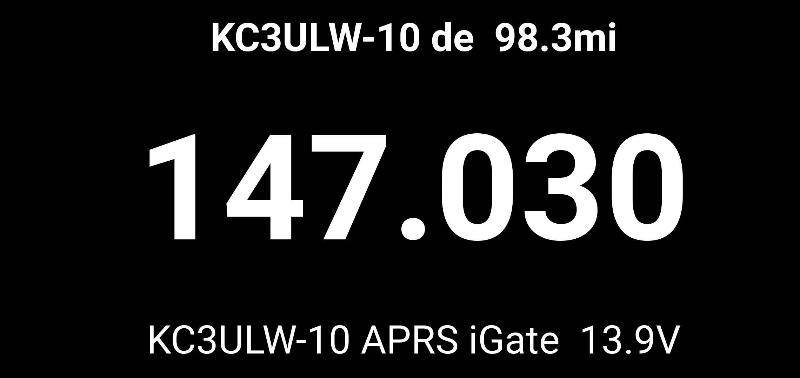

# APRS Frequency Monitor

## Overview

The **APRS Frequency Monitor** a kivy application modeled after APRSISCE/32's Frequency Monitor and uses the APRS-IS network to update it over the internet.

## Features

- **Real-Time APRS Monitoring**: Continuously listens for APRS packets over the internet.
- **GPS Integration**: Automatically starts GPS to obtain your current location and filters incoming packets based on proximity (within 100 miles).
- **Clean User Interface**: Displays the following information:
  - **Source**: The callsign of the station that sent the packet.
  - **Frequency**: Extracted frequency from the packet, displayed prominently.
  - **Additional Comment**: Any additional information contained in the packet.
- **Automatic Updates**: The display updates dynamically as new packets are received.

## Screenshot

## Acknowledgments

- **APRSISCE/32**: Special thanks to the developers of APRSISCE/32 for their inspiration and contributions to the amateur radio community.
- **PLYER**: GPS Functionality is taken directly from the example.
